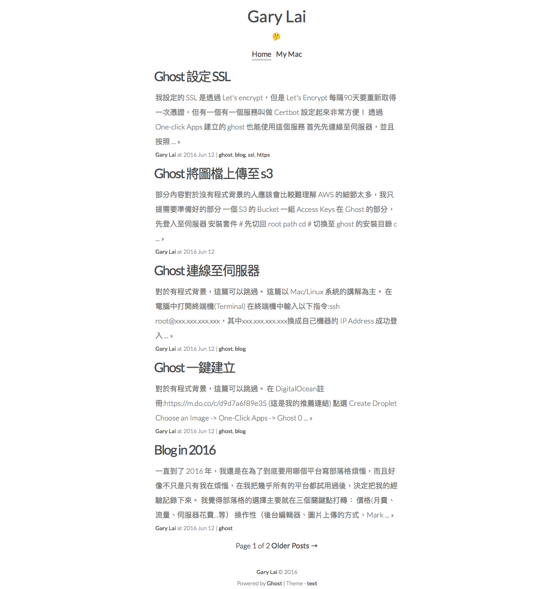

# Text for Ghost


## Introduction

This theme is for [Ghost](https://ghost.org), a blogging platform.

I focus on things below:
- Reader first: clear readability.
- A responsive theme along with less CSS code and simple HTML construction.
- Less animation, no font or image icon.  



## Demo

Live theme is use my blog: [blog.gary-lai.com](https://blog.gary-lai.com)

## Features

- Responsive
- Error Page(ex: 404, 500)
- Authors, Tags, Pages
- Navigation
- Code highlighting via [highlightjs](https://highlightjs.org/)  
  - Line numbers support (Optional)
- Google Analytics (Optional)
- Disqus(Optional)

## Installation

Chose one option below:

- Download as [zip](https://github.com/imgarylai/text/archive/master.zip) and put the folder `text` under `ghost/content/themes/`

- Use git: clone this repository under 'ghost/content/themes'

- DigitalOcean + Ghost: [How To Change Themes and Adjust Settings in Ghost](https://www.digitalocean.com/community/tutorials/how-to-change-themes-and-adjust-settings-in-ghost)

After install the theme, please restart server then you can change theme on settings page.

## Code Injection

### Blog Header

```
<script>
// to enable Google Analytics
var ga_id = 'YOUR UA ID HERE';

// to enable Disqus
var disqus_shortname = 'YOUR DISQUS SHORT NAME HERE'
</script>
```

### Blog footer

```
// to enable line number support
<script>
hljs.initLineNumbersOnLoad();
</script>
```

## Development

You should set your ghost on your develop machine, Please follow [official instruction](https://github.com/TryGhost/Ghost#developer-install-from-git).

Then clone this repository under this directory: `ghost/content/themes/`

Fire up local server and change your theme to `text`.

## License

Open sourced under the [MIT license](LICENSE.md).
